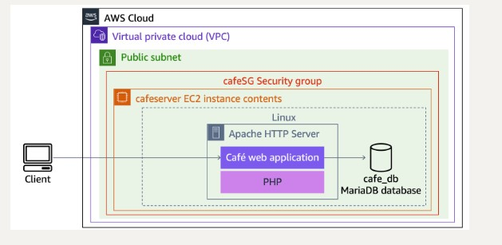

# AWS LAMP Stack Deployment

Automated deployment of a LAMP (Linux, Apache, MariaDB, PHP) stack on AWS using the AWS CLI and a Bash script.

## Overview

This project demonstrates how to provision and configure a complete LAMP web server on AWS entirely from the command line. The script handles VPC discovery, security group creation, AMI lookup, EC2 instance launch, and User Data automation — no manual clicking in the AWS Console required.

## Architecture



**Flow:**
1. Client sends an HTTP request
2. Request enters the VPC through the public subnet
3. Security group `cafeSG` allows ports 22 (SSH) and 80 (HTTP)
4. EC2 instance (`cafeserver`) runs Linux, Apache, PHP, and the Café web application
5. The web app connects to a MariaDB database (`cafe_db`) on the same instance

## AWS Services Used

| Service | Purpose |
| :--- | :--- |
| Amazon VPC | Isolated network for the EC2 instance |
| Amazon EC2 | Hosts the LAMP stack (t3.small) |
| Security Groups | Controls inbound traffic (SSH + HTTP) |
| IAM | Provides the instance profile for permissions |
| AWS Systems Manager (SSM) | Dynamically retrieves the latest Amazon Linux 2 AMI |
| User Data | Automates the LAMP installation on first boot |

## Prerequisites

- AWS account with appropriate IAM permissions
- AWS CLI configured (`aws configure`)
- An existing VPC named **Cafe VPC** with a public subnet named **Cafe Public Subnet 1**
- A key pair for SSH access

## Usage

1. Clone the repository:
   ```bash
   git clone https://github.com/khwezi407/aws-lamp-stack-deployment.git
   cd aws-lamp-stack-deployment
